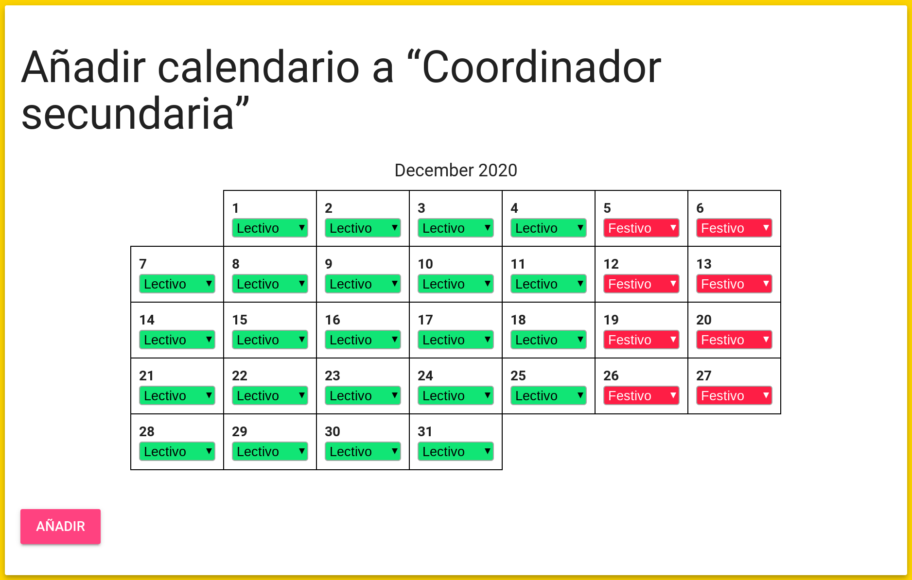

# Calendarios
El aplicativo necesita saber si un día es laborable o no (y en caso que sí sea laborable, si es lectivo) para poder generar los registros correctamente. Esto se realiza mediante la funcionalidad de calendarios, que se encuentra dentro de la sección de configuración.

!!! info "Calendarios por categorías"
    Existe un calendario llamado _calendario por defecto_, que es el que se aplica para todos los trabajadores. Aun así, como en algunas empresas se da el caso que no todos los trabajadores tienen el mismo calendario laboral, existe la posibilidad de crear calendarios que se aplican solo a una categoría en específico. De este modo, si un trabajador no está en ninguna categoría o su categoría no tiene asignado ningún calendario, el calendario que se usa es el calendario por defecto, pero si su categoría sí que tiene definido un calendario, se usa ese.

## Cómo añadir un calendario
1. En la sección de calendarios, haz clic en el botón <i class="material-icons">add</i> al lado del nombre de una categoría o de la sección _calendario por defecto_.
2. En la pantalla que aparece, introduce la fecha de inicio del calendario que quieres definir y la fecha de fin, y haz clic en el botón **Empezar a configurar el calendario**. Más tarde puedes añadir más calendarios para ir extendiendo los días que están definidos.

3. Configura qué tipo de día es cada día. Estas son las posibles opciones:
    1. **Lectivo**: día laborable en el que hay clase.
    2. **No lectivo**: día laborable en el que no hay clase.
    3. **Festivo**: día en el que no se trabaja.
4. Haz clic en el botón **Añadir**.

## Cómo duplicar un calendario
Si quieres copiar un calendario ya existente para añadirlo a otra categoría, sigue los siguientes pasos:

1. En la sección de calendarios, haz clic en el botón <i class="material-icons">code</i> al lado del calendario que quieras copiar.
2. En el diálogo que se abre, copia el código de la caja de texto.
3. Haz clic en el botón <i class="material-icons">add</i> al lado del nombre de una categoría o de la sección _calendario por defecto_.
4. En la página que se abre, pega el contenido que hemos copiado antes en la caja de texto de la segunda parte de la página, y haz clic en **Importar calendario**.
5. Haz los cambios necesarios al calendario, y haz clic en el botón **Añadir**.
