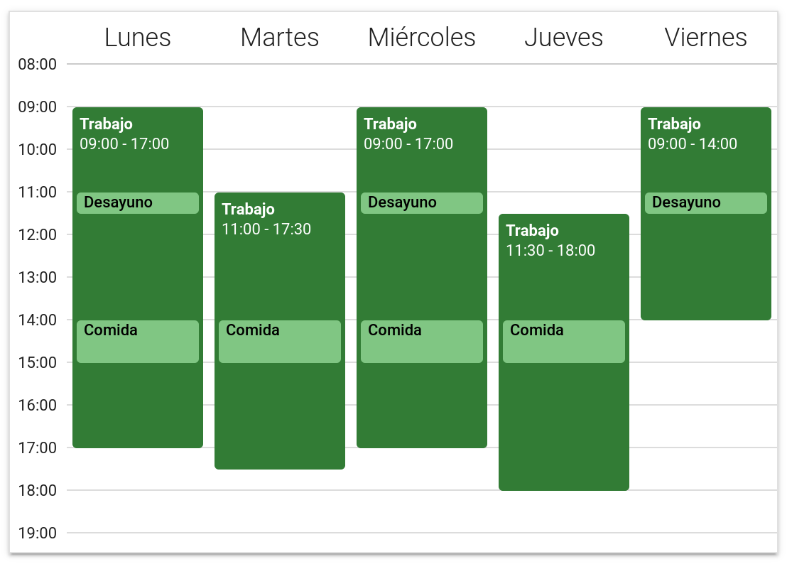

# Horarios base
Para poder controlar las horas que trabaja cada día un trabajador, se parte de los horarios base de cada trabajador. Los horarios base son los horarios que definen qué horas debería trabajar cada trabajador un día normal.

## Características de un horario base
Un horario base es un conjunto de horarios diarios para cada día de la semana, pudiendo configurar un horario diario específico para días lectivos y otro para días no lectivos, que definen cuándo trabaja un trabajador y, opcionalmente, también cuándo ocurren los descansos del desayuno y la comida.

Tienen definida una fecha de inicio de validez y una de fin, y también se puede definir si están activos o no. Los horarios base tienen efecto si se está dentro de su periodo de validez y están configurados como activos, en caso contrario no tienen ningún efecto en el aplicativo.

!!! note "Nota"
    Aunque en la captura de pantalla no aparezcan ni el sábado ni el domingo en el horario, es posible definir horarios para estos días, aunque por defecto están ocultos si no hay ningún horario configurado.

## Cómo definir los horarios base
Existen varias maneras de definir los horarios base: se puede crear una plantilla de horario y después copiarla a múltiples trabajadores a la vez (que es útil cuando muchos trabajadores comparten el mismo horario), o añadir horarios base manualmente a cada trabajador.

### Añadir horarios base mediante plantillas
1. Desde el menú lateral, accede a la sección **Trabajadores**.
2. En esa página, haz clic en el botón superior derecho llamado **Administrar plantillas**.
3. En la página que aparece, puedes acceder a las plantillas ya creadas o añadir una nueva con el botón <i class="material-icons">add</i>.
4. Después de crear una plantilla, accede a la sección **Trabajadores** de nuevo.
5. En esa sección, selecciona los trabajadores a los cuales quieras copiar la plantilla que has creado.
6. Haz clic en el botón <i class="material-icons">add_alarm</i> de la barra que aparece encima del listado de trabajadores.
7. Selecciona la plantilla que quieras copiar, y establece si las copias se definirán como activas o no.
8. Haz clic en el botón **Copiar**. Se abrirá una página con el resultado de la copia y si ha habido algún error.

### Añadir horarios base manualmente
1. Desde el menú lateral, accede a la sección **Trabajadores**.
2. Allí, haz clic en el botón <i class="material-icons">timelapse</i> al lado del trabajador al que quieras añadir un horario base.
  1. En el caso que el trabajador ya tuviera un horario activo en la fecha actual, se abrirá ese horario directamente. Así pues, haría falta hacer clic tamién en el botón **Administrar los horarios** de la parte superior derecha de la pantalla.
3. Haz clic en el botón <i class="material-icons">add</i> de la parte inferior derecha de la pantalla.

## Modificar un horario base
### Cambiar periodo de validez
Para cambiar el periodo de validez, haz clic en el menú <i class="material-icons">more_vert</i> y selecciona **Editar detalles**.

### Activar o desactivar el horario base
Haz clic en el botón **Activar**/**Desactivar** que aparece en la parte superior del horario base.

### Modificar/eliminar el horario de un día en concreto
Pon tu ratón encima del cuadro verde titulado **Trabajo** y haz clic en el botón <i class="material-icons">edit</i> o <i class="material-icons">delete</i> para modificarlo o eliminarlo respectivamente.

!!! note "Para dispositivos táctiles"
    Si estás en un dispositivo táctil, puedes hacer clic en el menú <i class="material-icons">more_vert</i> y seleccionar **Versión en texto plano** para poder ver los botones para editar o eliminar horarios diarios.

## Cómo ver rápidamente si un trabajador tiene definido un horario base
En el listado de trabajadores, al lado de cada trabajador, el icono <i class="material-icons">timelapse</i> está coloreado de varios colores, dependiendo de si el trabajador tiene un horario base o no. Además, también puedes filtrar los trabajadores según tengan definido un horario base o no. Esto es lo que significan los diferentes colores:

* <i class="material-icons" style="color: #f44336;">timelapse</i>: no existe ningún horario base activo en el día de hoy.
* <i class="material-icons" style="color: #ff9800;">timelapse</i>: existe un horario base activo en el día de hoy, pero solo se ha configurado el horario para días lectivos o para días no lectivos, pero no ambos.
* <i class="material-icons" style="color: #4caf50;">timelapse</i>: existe un horario base activo en el día de hoy configurado por completo.
