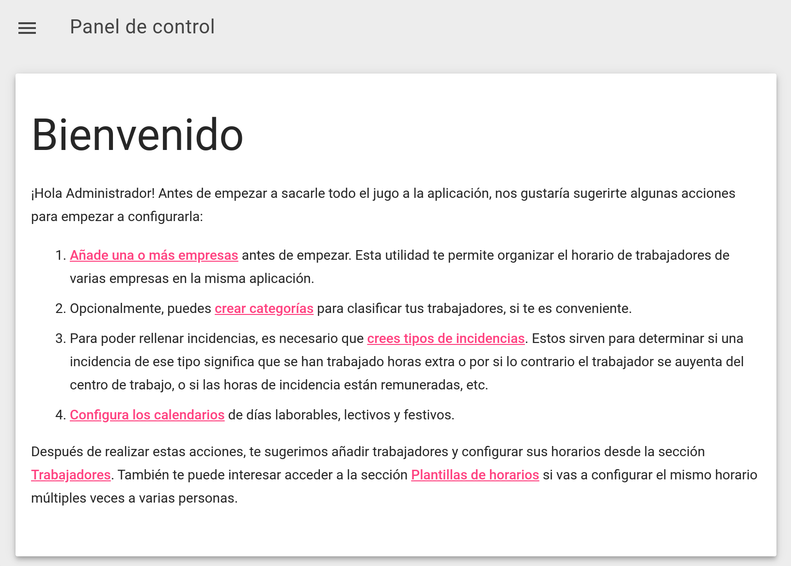

# Configuración
Una vez instalado el aplicativo, podemos empezar a configurar el aplicativo.

## Introducción de datos
Para empezar a configurar el aplicativo introduciendo los datos de la empresa como por ejemplo los empleados y sus horarios, entra a la página principal del aplicativo e inicia sesión. Después de iniciar sesión, verás una serie de pasos en la pantalla de bienvenida, que te servirán para empezar a introducir los datos:

Una vez empieces a realizar uno de los pasos, este saldrá de color gris, y cuando realices todos, el mensaje de bienvenida desaparecerá.

El aplicativo está diseñado con la base de que sea intuitivo y no haga falta leerse todo el manual de instrucciones para ser usado, sino más bien ser consultado en caso de dudas una vez esté configurado. Es por ello que, con el fin de explicar las funciones más esenciales en el mismo aplicativo sin necesidad de haber de consultar este manual, se encontrarán iconos con un signo de interrogación por todas las páginas que explican el funcionamiento de diversas partes del programa si se pone el ratón encima.

Aun así, este manual aportará más profundidad en cada una de las funciones del aplicativo, en caso que sea necesario.

## Notificaciones por correo electrónico
Para configurar las notificaciones por correo electrónico, hace falta modificar el archivo `config.php`. Se deben configurar las siguientes variables:

* **`$conf["mail"]["enabled"]`**: se debe definir como `true` para activar la funcionalidad del correo.
* **`$conf["mail"]["stmpauth"]` hasta `$conf["mail"]["remitentName"]`**: configuración de las credenciales del servidor SMTP de correo, desde donde se enviarán los correos.
* **`$conf["mail"]["subjectPrefix"]`**: prefijo añadido a los asuntos de los correos enviados. Permite identificar mejor las notificaciones enviadas de los demás correos recibidos por el trabajador.
* **`$conf["mail"]["adminEmail"]`**: opcional, se usa como dirección al que se envía un correo cada vez que un trabajador crea una incidencia (solo si está activada la opción `$conf["mail"]["capabilities"]["notifyOnWorkerIncidentCreation"]`).

Finalmente, se pueden configurar las variables `$conf["mail"]["capabilities"]["{tipo de notificación}"]` para activar o desactivar los distintos tipos de notificación (al lado de cada variable hay un comentario explicando qué tipo de notificación es cada una). Estos son los diferentes tipos de notificación que hay disponibles:

* **`notifyOnWorkerIncidentCreation`**: envía una notificación a `$conf["mail"]["adminEmail"]` cada vez que un trabajador añade una incidencia.
* **`notifyOnAdminIncidentCreation`**: envía una notificación a `$conf["mail"]["adminEmail"]` cada vez que un administrador añade una incidencia.
* **`notifyCategoryResponsiblesOnIncidentCreation`**: cada vez que se crea una incidencia, si el tipo de incidencia tiene activada la opción _notificar_, se enviará una notificación a sus responsables, si están definidos (para más información sobre los responsables de una categoría consulta [este artículo](../personas.md#categorias)).
* **`notifyWorkerOnIncidentDecision`**: cuando se revisa una incidencia creada por un trabajador, se envía una notificación al trabajador para que sepa si se ha aprovado o rechazado la incidencia.
* **`sendPendingValidationsReminder`**: envía notificaciones periódicas a los trabajadores que tengan incidencias o registros de horario pendientes para que los validen. Activar este tipo de notificaciones en el archivo `config.php` no tiene ningún efecto por sí solo (véase la siguiente subsección donde se explica cómo configurar este tipo de notificaciones), pero si se desactiva, se bloqueará el envío de este tipo de notificaciones.

### Notificación de validaciones pendientes
Las notificaciones de validaciones pendientes se realizan ejecutando el script `src/cron/pendingvalidationsreminder.php`. Lo que hace realmente este script es ver qué trabajadores acumulan algún elemento que esté pendiente de validarse durante más de un cierto periodo de tiempo, y enviarles una notificación a estos. De esta manera no se enviarán notificaciones a personas cuyos elementos pendientes de validar hayan aparecido en la sección de validación hace poco tiempo.

Así pues, para configurar estas notificaciones hay que realizar lo siguiente:

1. En el archivo `config.php`, configurar lo siguientes valores:
    1. Establecer `$conf["mail"]["capabilities"]["sendPendingValidationsReminder"]` a `true` para permitir este tipo de notificaciones.
    2. Establecer `$conf["validation"]["gracePeriod"]` al número de días que las incidencias/registros horarios pueden permanecer pendientes de validar y no generar una notificación.
2. Configurar que se ejecute el script `src/cron/pendingvalidationsreminder.php` periódicamente (por ejemplo, con el programa _crontab_). También se puede ejecutar este script manualmente (`php src/cron/pendingvalidationsreminder.php`) cuando se desee.

## Verificación en dos pasos
Para permitir a los usuarios configurar la verificación en dos pasos, se deben configurar las siguientes variables en `config.php`:

* **`$conf["secondFactor"]["enabled"]`**: se debe definir como `true` para permitir la verificación en dos pasos.
* **`$conf["secondFactor"]["origin"]`**: usado para las llaves de seguridad (WebAuthn), hay que introducir el dominio donde está alojado el aplicativo (por ejemplo, `example.org`).

## Configuración variada
Se recomienda echarle un vistazo al archivo `config.php` entero para ver otros valores que se pueden configurar, como por ejemplo el color del fondo de las páginas, opciones para los PDFs generados, etc. Estas opciones están comentadas claramente en el mismo archivo.
