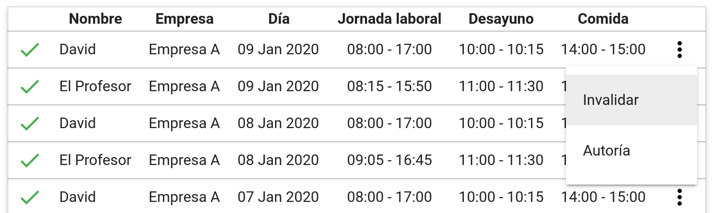

# Generación de registros
Cada día, al final del día, un programa transforma los horarios base en registros que dejan constancia del horario que hubiera tenido que hacer cada trabajador durante ese día. Esto se hace así porque luego el trabajador debe validar cada uno de estos registros y de esta forma tampoco se depende de que el horario base esté correctamente definido una vez ya se han generado y validado todos los registros.

## Algoritmo de generación de los registros
1. Primero se carga una lista de horarios base, que se trata de los horario base activos en el momento de generar los registros tal que la fecha en la que se ejecute esté dentro del periodo de validez del horario base.
2. Para cada uno de estos horarios base, se realiza lo siguiente:
    1. Se obtiene quién es el trabajador sobre el cual se define el horario en cuestión.
    2. Se obtiene el calendario laboral correspondiente al trabajador de la siguiente manera:
        1. Si el trabajador está dentro de una categoría, se busca si la categoría tiene definido un calendario para el día actual. Si es así, este es el calendario que se obtiene.
        2. En caso contrario, se busca si existe un calendario por defecto definido para el día actual. Si es así, este es el calendario que se obtiene.
        3. En caso contrario, salta un mensaje de advertencia y se pasa a tratar directamente el siguiente horario, ya que no se ha encontrado ningún calendario que nos diga qué tipo de día es el día actual.
    3. Se mira qué tipo de día es el día actual en el calendario obtenido. Si no existe un horario diario para el día de la semana actual (lunes-domingo) y tipo de día (lectivo/no lectivo/festivo), entonces se pasa a procesar el horario base siguiente, porque no tenemos que generar ningún registro.
    4. En este punto nos hemos asegurado de que hay que generar un registro. Es por ello que miramos si ya existe un registro generado para el trabajador y el día actual.
        1. En caso que ya exista un registro, salta un mensaje de advertencia y se pasa a tratar directamente el siguiente horario.
        2. En caso contrario, se procede a generar el registro, copiando los datos que había en el horario base para el día de la semana y tipo de día actual.

## Ver los registros generados
### Ver una lista global
Para ver una lista con todos los registros generados, se debe acceder a la sección **Registro** que hay en el menú lateral.

### Ver una lista para un trabajador
Se debe acceder a la sección **Trabajadores** y hacer clic en el icono <i class="material-icons">list</i> al lado de un trabajador.

## Corregir errores en los registros
Podría ser que al definir los horarios base se cometa algún error y haya que rectificarlo en los registros generados. Para ello, existen dos herramientas que nos permiten modificar indirectamente la tabla de registros con el fin de subsanar el error.

## Invalidar registros
Cada registro se puede invalidar, de tal manera que actúa como si no existiera. No es posible eliminar registros ya que la ley española prohibe que el registro horario pueda verse modificado por parte de la empresa, pero con el fin de arreglar los errores es posible invalidar los registros, dejando una copia del registro que aunque no tenga ningún tipo de efecto, se pueda seguir consultando para corroborar que el registro se ha invalidado.

### Invalidar un registro específico
Para hacer esto, hay que hacer clic en el botón <i class="material-icons">more_vert</i> al lado de un registro en un listado de registros y seleccionar la opción **Invalidar**.

### Invalidar varios días de registros
Es posible invalidar varios días de registros para varios trabajadores concretos mediante una sola acción, lo que facilita la invalidación de un error que ha ocurrido durante mucho tiempo y/o para varios trabajadores.

Para acceder a la herramienta que permite hacer esto, hay que ser un usuario de tipo *hiperadministrador*, ya que los usuarios de tipo *administrador* no tienen acceso a esta herramienta. Ve a la sección **Configuración** desde el menú lateral, y selecciona la opción **Herramientas avanzadas**. Allí, selecciona la opción **Invalidar registros en masa** y sigue las instrucciones de la página.

## Generar registros manualmente
Esta herramienta permite generar registros manualmente de un día en concreto a partir de los horarios base con el mismo algoritmo que lo hace el script que los genera automáticamente, pero para los horarios pertenecientes a un subconjunto de trabajadores, en vez de obtener todos los horarios base aplicables.

Para acceder a la herramienta, también se debe ser un usuario de tipo *hiperadministrador*. Ve a la sección **Configuración** desde el menú lateral, y selecciona la opción **Herramientas avanzadas**. Allí, selecciona la opción **Generar registros manualmente**.

!!! warning "Modo avanzado"
    Si se hace clic en el botón **Activar modo avanzado** de la herramienta, se podrá seleccionar que se generen los registros horarios durante un intervalo de fechas en vez de en un día en específico. Lo que hará esto es recorrer el algoritmo descrito anteriormente para cada día del intervalo de fechas.

    El resultado de las acciones que se toman con la herramienta en este modo pueden ser catastróficas, así que antes de usarlo asegúrate de leer y comprender la advertencia que aparece cuando entras en este modo.

## Ver _logs_
Cada vez que se ejecuta el script de generación de registros o se usa la herramienta para generar registros manualmente, se guarda un archivo de texto llamado _log_ con el resultado de la acción y si ha habido errores.

Es conveniente ver si ha habido algún error o advertencia de vez en cuando, porque en este caso puede que no se hayan generado todos los registros correctamente y haga falta corregirlo manualmente.

Para acceder a los _logs_, se debe ir a la sección **Configuración** desde el menú lateral y hacer clic en la opción ***Logs***. En el listado aparecerán los iconos <i class="material-icons" style="color: #ff9800;">warning</i>, <i class="material-icons" style="color: #f44336;">error</i> y <i class="material-icons" style="color: #b71c1c;">error</i> dependiendo de si ese _log_ contiene un mensaje de advertencia, de error, o de error fatal. Mediante el icono <i class="material-icons">notes</i> se puede ver el _log_.

### Causas de una advertencia
Una advertencia puede causarse por los siguientes motivos, que son causa de una mala configuración por parte del administrador:

* No se ha podido encontrar un calendario para algún trabajador que tenía un horario asignado.
* Un trabajador ya tenía un registro creado para el mismo día para el que se intentaba generar el registro, así que no se ha generado.

### Causas de un error
Un error puede causarse por los siguientes motivos, que son siempre errores del aplicativo y no tienen por qué implicar un error por parte del administrador:

* Al intentar insertar el registro en la base de datos ha ocurrido un problema interno.

### Causas de un error fatal
Un error fatal consiste en errores inesperados del aplicativo, como los errores, y estas son las posibles causas:

* No se han podido cargar los calendarios por un error interno (y no se ha generado ningún registro).
* No se han podido cargar los horarios aplicables por un error interno (y no se ha generado ningún registro).
* Mientras se procesaba un registro, ha ocurrido un error interno y no se han podido obtener los detalles del registro (puede que se hayan procesado otros registros correctamente).
