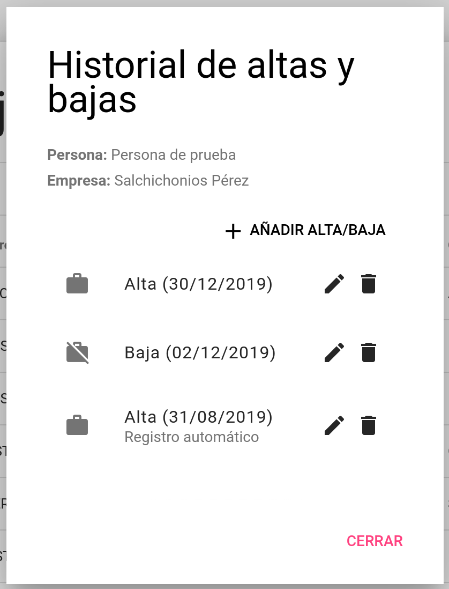

# Trabajadores
El concepto de trabajador es diferente al de persona. Un trabajador se define como la relación entre una persona y una empresa. Así pues, una persona puede tener asociada diversos trabajadores, en caso que esté trabajando para varias empresas a la vez, y los datos de inicio de sesión de la persona sirven para administrar a todos los trabajadores asociados.

## Cómo añadir un trabajador
Para añadir un trabajador, se debe ir a la sección **Personas**. Allí, haz clic en el botón <i class="material-icons">work</i> al lado de una persona de la tabla, y en el diálogo que aparece podrás añadir la empresa al usuario. Esta acción creará un historial de altas y bajas de esa persona en esa empresa con un registro de alta autogenerado.

## Historial de altas y bajas
El historial de altas y bajas es un registro modificable de las altas y bajas que tiene un trabajador. Se puede acceder a él desde el diálogo mencionado en la sección anterior o haciendo clic en el botón <i class="material-icons">history</i> en la sección **Trabajadores**.

Para determinar si un trabajador está de alta o de baja, el aplicativo cogerá el último registro con fecha anterior a la fecha actual, y lo determinará a partir de este. En el caso que no exista ningún registro de alta/baja anterior a la fecha actual, el aplicativo entenderá que el trabajador está de baja.

!!! info "Bajas de personas vs. bajas de trabajadores"
    Anteriormente, cuando todavía no existía la funcionalidad de los historiales de altas y bajas, el aplicativo permitía poner en estado de alta/baja las personas y los trabajadores por separado. Ahora, con el historial de altas y bajas, la funcionalidad anterior de altas/bajas ha sido eliminado.

    Así pues, para mantener la compatibilidad con la vista anterior de altas/bajas, se determina la condición de alta/baja a partir de los nuevos historiales.

    En el caso de las personas, ahora se determina que están de baja si no cuelga de él ningún trabajador que esté dado de alta.
