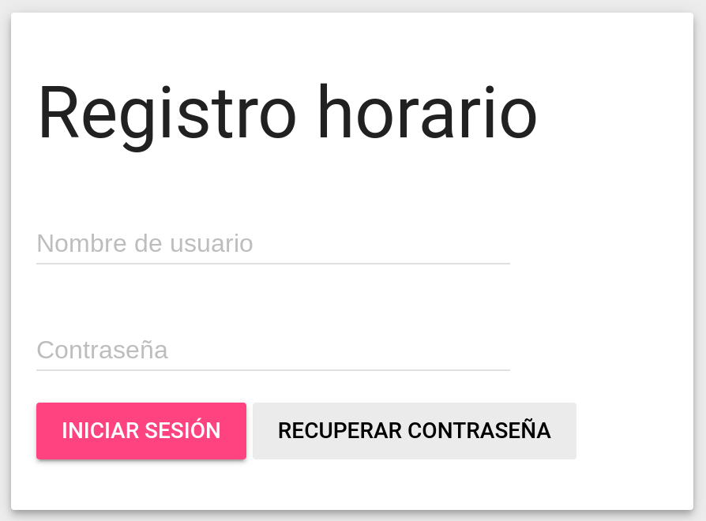

# Cómo restablecer la contraseña
Para restablecer tu contraseña, ve a la página principal del aplicativo y haz clic en el botón **Recuperar contraseña**. Tendrás que introducir tu documento de identificación (DNI, NIE, etc.) con las letras en mayúsculas, y el correo electrónico asociado a tu cuenta en el aplicativo (normalmente la dirección de correo de la empresa). Después de enviar el formulario, recibirás en tu correo electrónico un enlace para cambiar la contraseña.

Si esto no funciona, puedes pedir al administrador del aplicativo que te cambie la contraseña, ya que dispone de esta opción desde la vista de administrador. Lo más recomendable si se hace esto es que después de volver a tener acceso al aplicativo cambies tu contraseña para que solo tú sepas el usuario y contraseña de tu cuenta.
