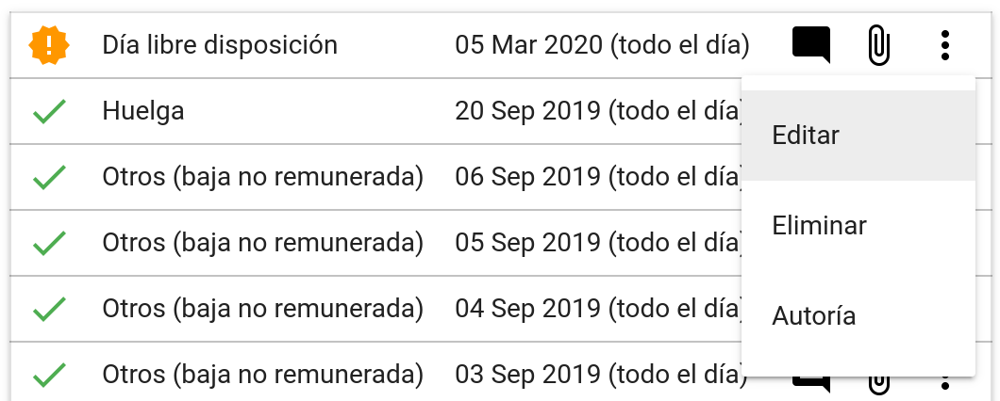
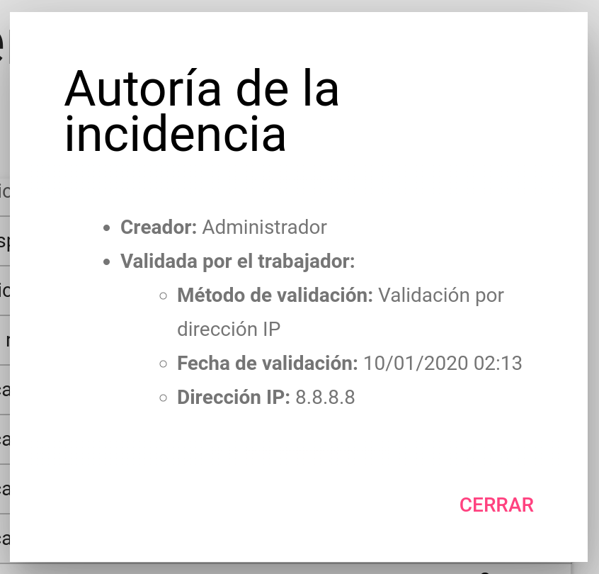
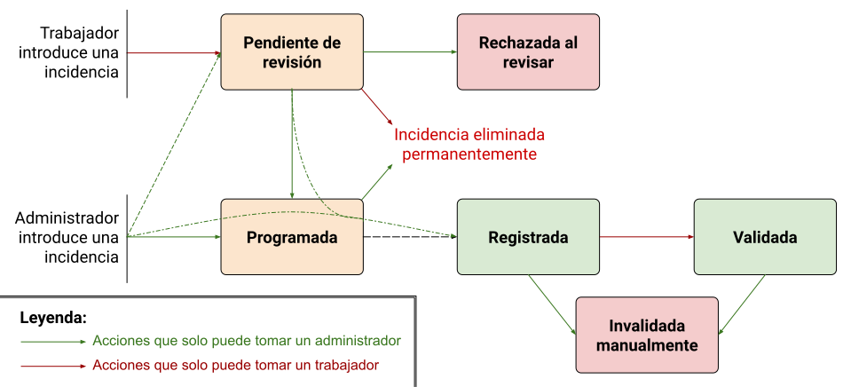

# Incidencias
Las incidencias son elementos que se sobreponen a los horarios base de los trabajadores para acabar de concretar qué horario exacto ha seguido un trabajador un día en específico.

## ¿Qué incidencias aparecen en el listado?
En el listado de incidencias aparecen todas tus incidencias: tanto las que has creado tú como las que han creado los administradores. A parte, también aparecen las incidencias que hayas creado y los administradores hayan rechazado, y las que han invalidado los administradores.

## Cómo añadir incidencias
Para añadir una incidencia, accede a la sección **Incidencias** desde el menú lateral y haz clic en el botón <i class="material-icons">add</i> de la parte inferior derecha de la página. Luego, rellena el formulario y haz clic en el botón **Añadir**.

Es posible que el administrador no permita que los trabajadores introduzcan incidencias de ciertos tipos. Si el tipo de incidencia no aparece en el selector, tendrás que contactar con recursos humanos para que introduzcan ellos la incidencia.

Después de añadir una incidencia, se pueden adjuntar archivos a esta mediante el botón <i class="material-icons">attach_file</i> que aparece al lado de la incidencia creada. También se puede modificar o eliminar antes de que se revise mediante las opciones presentes en el menú <i class="material-icons">more_vert</i>.

### ¿Qué ocurre después de introducir la incidencia?
Después de introducir la incidencia, los administradores deberán revisarla para aceptarla o rechazarla. Si los administradores lo han configurado en el aplicativo, recibirás una notificación por correo electrónico del resultado de la revisión.

## Autoría de una incidencia
Si deseas ver quién ha creado, revisado, validado o hecho la última modificación a la incidencia, puedes verlo yendo al menú de la incidencia y seleccionando **Autoría**.

## Estado de una incidencia
Cada incidencia puede estar en diferentes estados en el transcurso del tiempo:

* **Pendiente de revisión** (<i class="material-icons" style="color: #ff9800;">new_releases</i>): una incidencia está en este estado cuando la ha añadido un trabajador y todavía no ha sido revisada por los administradores.
* **Programada** (<i class="material-icons" style="color: #ff9800;">schedule</i>): cuando una incidencia se ha añadido correctamente (y si la ha introducido un trabajador ya se ha revisado) pero ocurrirá en el futuro.
* **Registrada** (<i class="material-icons" style="color: #4caf50;">check</i>): cuando una incidencia ya ha sucedido.
* **Validada** (<i class="material-icons" style="color: #4caf50;">verified_user</i>): cuando una incidencia ya ha sucedido y el trabajador la ha validado (para más información, véase el apartado [validaciones](validaciones.md)).
* **Rechazada al revisar** (<i class="material-icons" style="color: #f44336;">block</i>): cuando una incidencia creada por un trabajador se rechaza en el proceso de revisión. Estas incidencias no tienen ningún efecto en el aplicativo, pero se mantienen en el aplicativo para poderse consultar.
* **Invalidada manualmente** (<i class="material-icons" style="color: #f44336;">delete_forever</i>): cuando una incidencia que estaba registrada o validada se elimina, esta se mantiene en el aplicativo con el estado de invalidada. Estas incidencias no tienen ningún efecto en el aplicativo, y también se mantienen en el aplicativo únicamente para que se puedan consultar.

!!! success "PDFs exportados"
    Las únicas incidencias que se incluyen en los PDFs exportados son las registradas y las validadas.

## Vida de una incidencia
Este es un diagrama que expone los estados por los que puede pasar una incidencia a lo largo de su vida:

